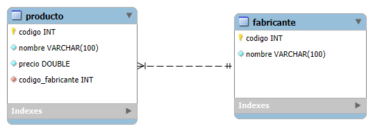
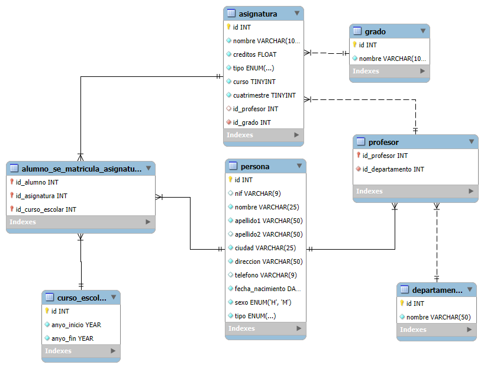

# Tasca S2.02 - MySQL Queries

## 🧩 Descripció

Aquest projecte conté un conjunt de **consultes SQL** realitzades sobre dues bases de dades: **Tienda** i **Universidad**.  
L’objectiu és practicar la construcció de consultes `SELECT` amb diferents clàusules, operadors i funcions d’agregació, així com l’ús de `JOIN`, subconsultes i agrupaments.

---

## 🗃️ Base de dades 1: Tienda

La base de dades **Tienda** conté dues taules relacionades:

- **producto** (`codigo`, `nombre`, `precio`, `codigo_fabricante`)
- **fabricante** (`codigo`, `nombre`)

El camp `codigo_fabricante` de la taula **producto** es relaciona amb el camp `codigo` de la taula **fabricante**.

#### 🔹 Model E-R – Tienda
Representació de la base de dades **Tienda**, amb les taules `producto` i `fabricante`, i la seva relació per la clau `codigo_fabricante`.



---

## 📋 Consultes a realitzar (Tienda)

1. Llista el nom de tots els productes.  
2. Llista el nom i el preu de tots els productes.  
3. Llista totes les columnes de la taula `producto`.  
4. Llista el nom dels productes, el preu en euros i en dòlars (USD).  
5. Igual que l’anterior, amb àlies: **nom_producte**, **euros**, **dòlars**.  
6. Llista els noms i preus amb els noms en majúscules.  
7. Llista els noms i preus amb els noms en minúscules.  
8. Mostra el nom dels fabricants i els dos primers caràcters del nom en majúscules.  
9. Llista noms i preus arrodonint el valor del preu.  
10. Llista noms i preus truncant els decimals.  
11. Llista els codis dels fabricants que tenen productes.  
12. Igual que l’anterior, eliminant els codis repetits.  
13. Llista els noms dels fabricants en ordre ascendent.  
14. Llista els noms dels fabricants en ordre descendent.  
15. Llista els productes ordenats pel nom (ASC) i pel preu (DESC).  
16. Mostra les 5 primeres files de la taula `fabricante`.  
17. Mostra 2 files a partir de la quarta (inclosa).  
18. Llista el producte més barat (amb `ORDER BY` i `LIMIT`).  
19. Llista el producte més car (amb `ORDER BY` i `LIMIT`).  
20. Productes del fabricant amb codi = 2.  
21. Nom del producte, preu i nom del fabricant.  
22. Igual que l’anterior, ordenat pel nom del fabricant.  
23. Codi i nom del producte, codi i nom del fabricant.  
24. Producte més barat (nom, preu i fabricant).  
25. Producte més car (nom, preu i fabricant).  
26. Productes del fabricant **Lenovo**.  
27. Productes del fabricant **Crucial** amb preu > 200 €.  
28. Productes dels fabricants **Asus**, **Hewlett-Packard** i **Seagate** (sense `IN`).  
29. Igual que l’anterior, fent servir `IN`.  
30. Productes de fabricants el nom dels quals acaba amb la vocal *e*.  
31. Productes de fabricants el nom dels quals conté el caràcter *w*.  
32. Productes amb preu ≥ 180 €, ordenats per preu (DESC) i nom (ASC).  
33. Fabricants amb productes associats.  
34. Tots els fabricants amb els seus productes (incloent-hi els que no en tenen).  
35. Fabricants sense productes associats.  
36. Productes del fabricant **Lenovo** (sense `INNER JOIN`).  
37. Productes amb el mateix preu que el més car de **Lenovo** (sense `INNER JOIN`).  
38. Producte més car del fabricant **Lenovo**.  
39. Producte més barat del fabricant **Hewlett-Packard**.  
40. Productes amb preu ≥ al més car de **Lenovo**.  
41. Productes del fabricant **Asus** amb preu superior a la mitjana dels seus productes.

---

## 🏫 Base de dades 2: Universidad

Per a aquesta part, cal descarregar el fitxer **`schema_universidad.sql`**, carregar la base de dades a MySQL i visualitzar el diagrama E-R.  

#### 🔹 Model E-R – Universitat
Representació de la base de dades **Universitat**.



A continuació, s’han d’efectuar les següents consultes:

### Consultes bàsiques

1. Cognoms i nom de tots els alumnes, ordenats alfabèticament.  
2. Alumnes que no tenen número de telèfon.  
3. Alumnes nascuts l’any 1999.  
4. Professors/es sense telèfon i amb NIF acabat en “K”.  
5. Assignatures del primer quadrimestre, tercer curs, del grau amb id = 7.  
6. Professors/es i el nom del departament associat.  
7. Assignatures i anys cursats per l’alumne amb NIF 26902806M.  
8. Departaments amb professors/es que imparteixen assignatures del **Grau en Enginyeria Informàtica (Pla 2015)**.  
9. Alumnes matriculats durant el curs 2018/2019.

---

### Consultes amb LEFT JOIN i RIGHT JOIN

10. Professors/es i departaments associats (incloent els sense departament).  
11. Professors/es sense departament.  
12. Departaments sense professors/es.  
13. Professors/es que no imparteixen cap assignatura.  
14. Assignatures sense professor/a assignat.  
15. Departaments que no han impartit assignatures.

---

### Consultes resum

16. Nombre total d’alumnes.  
17. Nombre d’alumnes nascuts el 1999.  
18. Nombre de professors/es per departament (només els que en tenen).  
19. Nombre de professors/es per departament (incloent els buits).  
20. Nombre d’assignatures per grau (incloent els graus sense assignatures).  
21. Graus amb més de 40 assignatures.  
22. Suma de crèdits per tipus d’assignatura i per grau.  
23. Nombre d’alumnes matriculats per curs escolar.  
24. Nombre d’assignatures impartides per professor/a (incloent els que no imparteixen).  
25. Dades de l’alumne/a més jove.  
26. Professors/es amb departament associat que no imparteixen cap assignatura.

---

## 🧠 Nivells de competència

- **Nivell 1** → 37 consultes correctes (mínim 20 del diagrama *Universitat*).  
- **Nivell 2** → Entre 37 i 56 consultes correctes (mínim 20 del diagrama *Universitat*).  
- **Nivell 3** → Més de 56 consultes correctes (mínim 20 del diagrama *Universitat*).

---

## ⚙️ Requisits tècnics

- MySQL 8.0 o superior.  
- Els scripts s’han d’executar sense errors en una base de dades local.  
- El projecte s’ha desenvolupat fent servir **Docker** i **Docker Compose** per a la creació i gestió del contenidor MySQL.  
- Es recomana utilitzar **MySQL Workbench** per executar les consultes i visualitzar els resultats.

### 🧱 Fitxer `docker-compose.yml`

```yaml
version: '3.9'

services:
  mysql:
    image: mysql:8.0
    container_name: mysql_queries
    restart: unless-stopped
    environment:
      MYSQL_ROOT_PASSWORD: admin123
      MYSQL_DATABASE: db_queries
      MYSQL_USER: esther
      MYSQL_PASSWORD: key123
    ports:
      - "3307:3306"
    volumes:
      - mysql_data:/var/lib/mysql2

volumes:
  mysql_data:

```

---

## ▶️ Execució

1. Carrega els esquemes:
   ```sql
   SOURCE schema_tienda.sql;
   SOURCE schema_universidad.sql;

   
